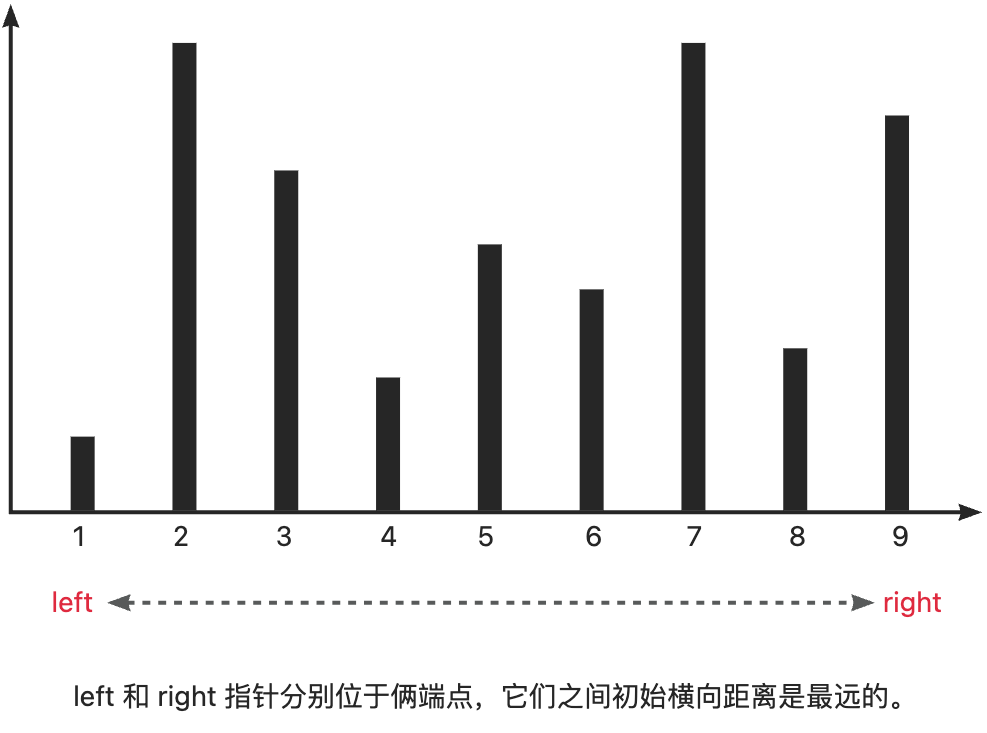
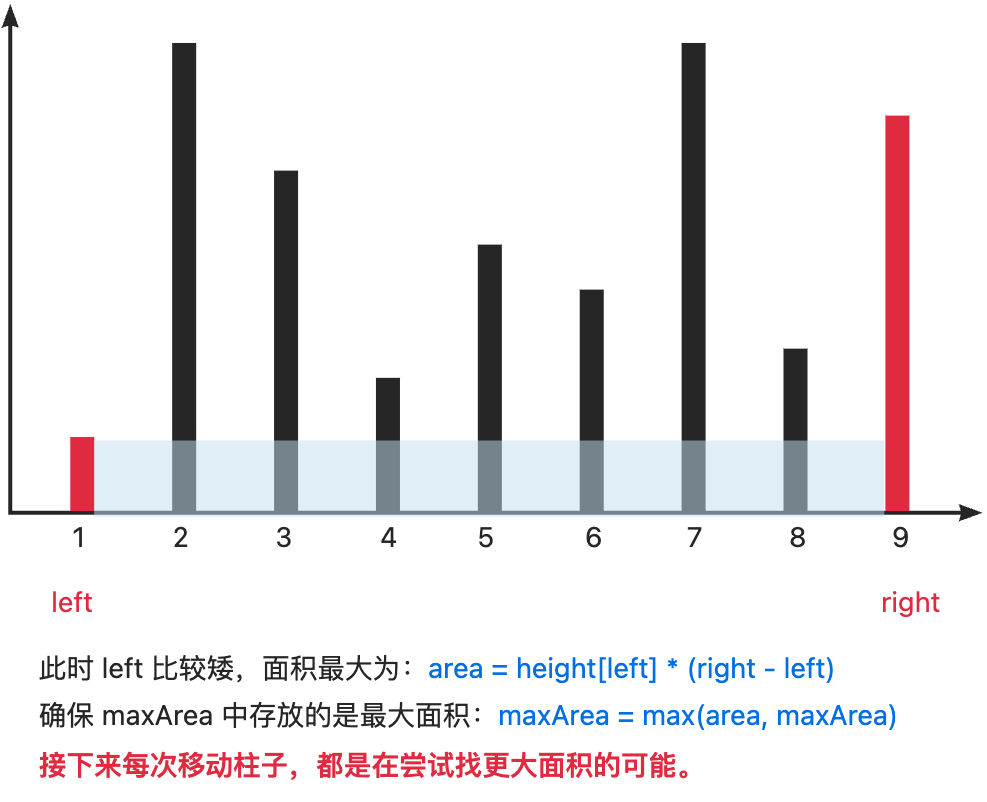
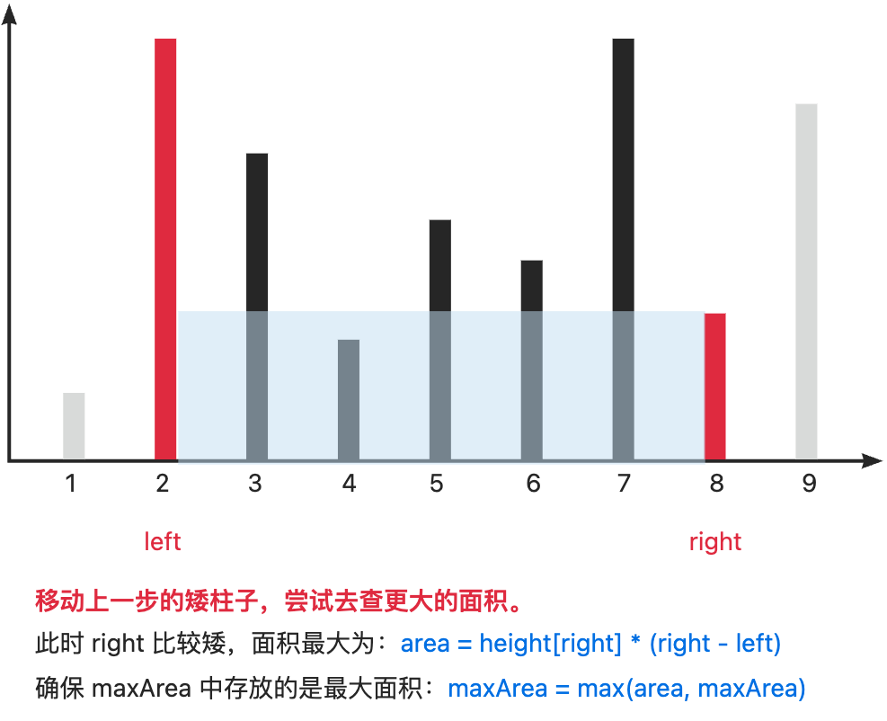
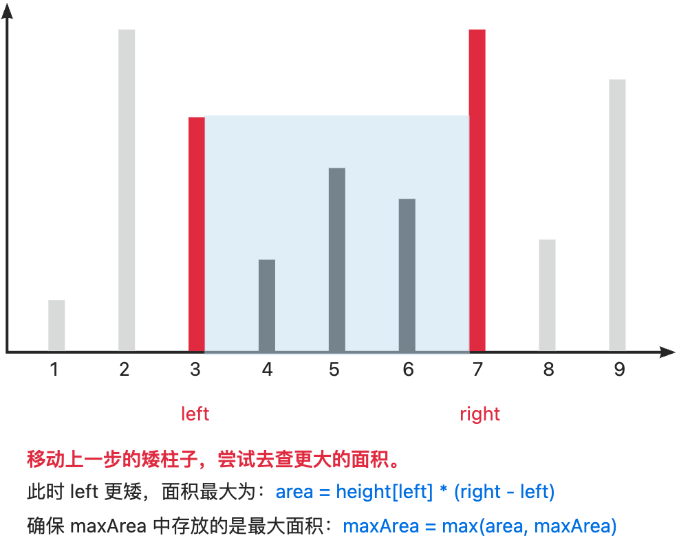
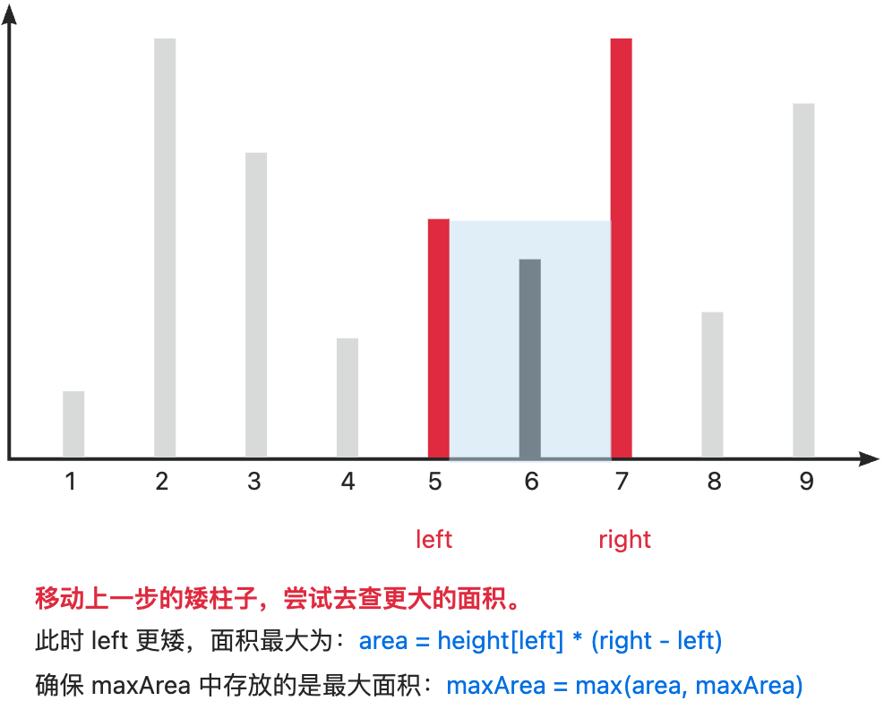
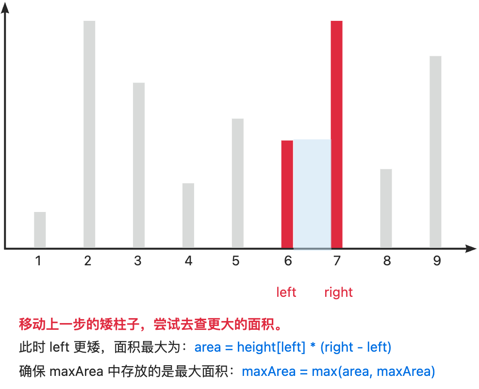
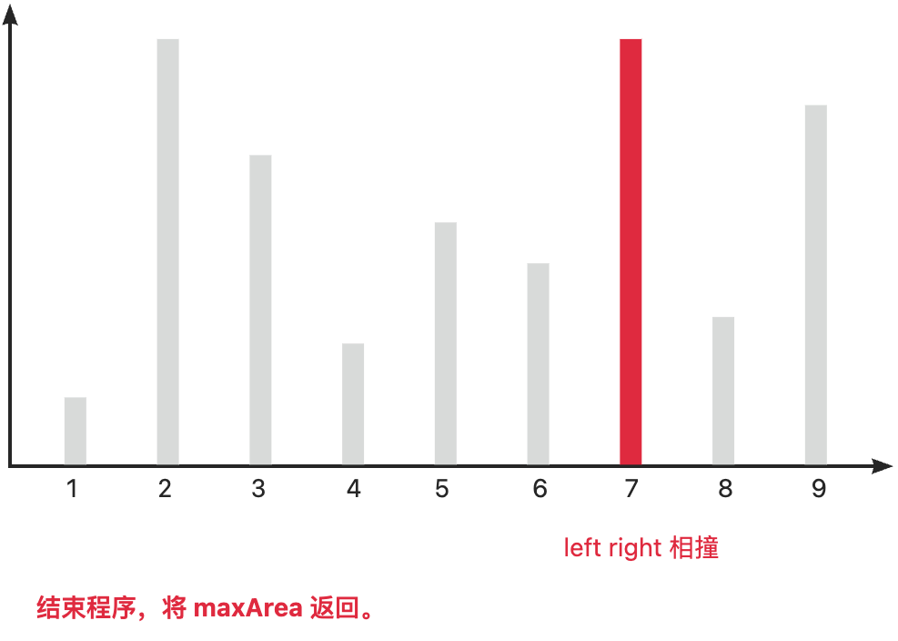

# [0011. 盛最多水的容器【中等】](https://github.com/Tdahuyou/TNotes.leetcode/tree/main/notes/0011.%20%E7%9B%9B%E6%9C%80%E5%A4%9A%E6%B0%B4%E7%9A%84%E5%AE%B9%E5%99%A8%E3%80%90%E4%B8%AD%E7%AD%89%E3%80%91)

<!-- region:toc -->

- [📂 TNotes.yuque](https://www.yuque.com/tdahuyou/tnotes.yuque/)
  - [TNotes.yuque.leetcode.0011](https://www.yuque.com/tdahuyou/tnotes.yuque/leetcode.0011)
- [1. 🔗 links](#1--links)
- [2. 📝 Description](#2--description)
- [3. 🎯 Solutions.1 - 暴力枚举](#3--solutions1---暴力枚举)
- [4. 🎯 Solutions.2 - 碰撞指针](#4--solutions2---碰撞指针)
- [5. ❌ 问题解法 - 栈溢出](#5--问题解法---栈溢出)
- [6. ❌ 问题解法 - 超时](#6--问题解法---超时)

<!-- endregion:toc -->

## 1. 🔗 links

- https://leetcode.cn/problems/container-with-most-water/solutions/11491/container-with-most-water-shuang-zhi-zhen-fa-yi-do/
  - 参考题解

## 2. 📝 Description

::: details [leetcode](https://leetcode.cn/problems/container-with-most-water/)

给定一个长度为 `n` 的整数数组  `height` 。有  `n`  条垂线，第 `i` 条线的两个端点是  `(i, 0)`  和  `(i, height[i])` 。

找出其中的两条线，使得它们与  `x`  轴共同构成的容器可以容纳最多的水。

返回容器可以储存的最大水量。

**说明：** 你不能倾斜容器。

**示例 1：**


- 输入：[1,8,6,2,5,4,8,3,7]
- 输出：49
- 解释：图中垂直线代表输入数组 [1,8,6,2,5,4,8,3,7]。在此情况下，容器能够容纳水（表示为蓝色部分）的最大值为  49。

**示例 2：**

- 输入：height = [1,1]
- 输出：1

**提示：**

- `n == height.length`
- `2 <= n <= 10^5`
- `0 <= height[i] <= 10^4`

:::

## 3. 🎯 Solutions.1 - 暴力枚举


```javascript
/**
 * @param {number[]} height
 * @return {number}
 */
var maxArea = function (height) {
  const len = height.length
  let maxArea = (len - 1) * Math.min(height[0], height[len - 1])

  // →
  for (let l = 0; l < len; l++) {
    for (let r = len - 1; r > l; r--) {
      if (height[r] >= height[l]) {
        const area = (r - l) * height[l]
        maxArea = maxArea > area ? maxArea : area
        break
      }
    }
  }

  // ←
  for (let r = len - 1; r > 0; r--) {
    for (let l = 0; l < r; l++) {
      if (height[l] >= height[r]) {
        const area = (r - l) * height[r]
        maxArea = maxArea > area ? maxArea : area
        break
      }
    }
  }

  return maxArea
}
```

- 时间复杂度：$O(n^2)$
- 空间复杂度：$O(1)$

---

**解题思路：**

- `→` 从左往右扫，每次都把最大的矩形找到，然后丢到 `areaArr` 中。
- `←` 从右往左扫，每次都把最大的矩形找到，然后丢到 `areaArr` 中。

最后，将 `areaArr` 中的最大值返回。

上述是经过优化后的暴力解法，如果更暴力的话，通不过。。。

[暴力枚举导致栈溢出问题](#mCZrn)

[暴力枚举导致超时问题](#Qxt3W)

## 4. 🎯 Solutions.2 - 碰撞指针

```javascript
var maxArea = function (height) {
  const len = height.length
  let l = 0,
    r = len - 1,
    max_area = 0

  while (l < r) {
    max_area = Math.max(max_area, (r - l) * Math.min(height[l], height[r]))
    height[l] < height[r] ? l++ : r--
  }

  return max_area
}
```

- 时间复杂度：$O(n)$
- 空间复杂度：$O(1)$

---

**思考：该解法有遍历所有的可能性吗？**

答：<u>没有，但是却覆盖了所有可能的情况</u>，每次遍历看似只考虑了一种可能，但实际上过滤掉了很多不可能的解。

---

**思考：为什么不会错过最大的面积？**

简单想的话，可以从下面两点入手：

1. 答案 `(ansLeft, ansRight)` 一定存在，并且 `0 <= ansLeft <= ansRight <= len - 1` 一定在区间内部。
2. 我们从端点开始移动指针，每次往中间移动一步矮的指针，每次移动都是在尝试往最大的可能性上靠，确保了单调性。

详细点儿的正确性证明，可以参考下面这篇题解。[链接](https://leetcode.cn/problems/container-with-most-water/solutions/11491/container-with-most-water-shuang-zhi-zhen-fa-yi-do/)


::: swiper


















:::

> 【备注】切换主题为 light 查看，dark 预览效果不好。

## 5. ❌ 问题解法 - 栈溢出

```javascript
/**
 * @param {number[]} height
 * @return {number}
 */
var maxArea = function (height) {
  const areaArr = [],
    len = height.length

  for (let i = 0; i < len; i++)
    for (let j = i + 1; j < len; j++)
      areaArr.push((j - i) * Math.min(height[i], height[j]))

  return Math.max(...areaArr)
}
```


暴力解法的逻辑很简单，将所有可能都罗列出来，丢到一个数组中，最后返回数组中的最大值。这种暴力解法，从逻辑上来说，好像是可以行得通的， 但是最终报了个栈溢出的错误。问题其实就出在了 `Math.max(...areaArr)` 函数调用上。

我们先单独拎一个 demo 出来。

```javascript
// const height = [ ... ]
console.log(height.length) // 5000
// 上面定义了一个 height，一共有 5000 个数字。
const areaArr = [],
  len = height.length

for (let i = 0; i < len; i++)
  for (let j = i + 1; j < len; j++)
    areaArr.push((j - i) * Math.min(height[i], height[j]))

console.log(areaArr.length) // 12497500
// console.log(Math.max(...areaArr)) // 将会导致栈溢出
// 问题不是出在 Math.max 函数身上，而是出在了函数调用上。
// 即便你不调用 Math.max，而是自定义一个 test 函数，然后把 areaArr 展开给传递进去，依旧会栈溢出的错误。
function test(args) {
  console.log(args)
}
// test(...areaArr)
```

在 `Math.max(...areaArr)` 中，展开运算符会尝试将 `areaArr` 中的所有元素作为独立参数传递给 `Math.max` 函数。`areaArr` 有 12,497,500 个元素，使用展开运算符时，相当于调用 `Math.max` 时传递了 12,497,500 个参数（**约 1250 万**）。

JavaScript 引擎对函数参数的数量是有硬性限制的，通常在**数万到数十万**之间，具体取决于引擎的实现和运行环境。传递如此大量的参数会超出这个限制，从而导致栈溢出错误。

可以把 `test(...areaArr)` 注释给取消掉，跑一下代码看看，你发会先只要在调用函数的时候，尝试将展开的 `areaArr` 作为参数传递给函数，就会报栈溢出的错误。


**调用栈的限制**

调用栈是一个用来管理函数调用的内存区域。在递归调用或大量函数调用时，栈空间可能会耗尽。在这个案例中，栈溢出并不是因为递归调用，而是因为尝试在一次函数调用中传递过多的参数，这些参数会占用大量的栈空间。

当你看到 `RangeError: Maximum call stack size exceeded`，也就意味着栈溢出了。

你可以通过下面这俩函数，来粗略地测试一下 JavaScript 引擎的调用栈的深度，以及验证 JavaScript 引擎中函数参数数量的上限。

```javascript
function testMaxArgs(limit) {
  const args = new Array(limit).fill(0)
  try {
    // 使用一个简单的函数来测试
    ;((...args) => {})(...args)
    return true // 没有抛出异常，测试通过
  } catch (e) {
    return false // 捕获到异常，测试失败
  }
}

function findMaxArgs() {
  let l = 1 // 起始点
  let r = 1000000 // 假设上限为 100 万个参数
  let mid

  // 用二分查找法来查你当前开发环境下，函数最大支持的参数数量。
  while (l < r - 1) {
    mid = Math.floor((l + r) / 2)
    testMaxArgs(mid) ? (l = mid) : (r = mid)
  }
  return l // low 应该是最大的支持参数数量
}

console.log(findMaxArgs()) // 110223
```

`testMaxArgs` 一旦参数溢出，就会报错，并 `return false`，否则正常执行，并 `return true`。以此来判断二分查找区间应该如何变化，通过不断的试错，直到头尾指针相撞。

```javascript
function testStackDepth(depth) {
  try {
    return testStackDepth(depth + 1)
  } catch (e) {
    return depth
  }
}

console.log(testStackDepth(0)) // 9186
```

每次递归调用时，将参数 depth 的值加 1，并尝试继续递归调用 testStackDepth 函数。当调用栈的深度超过 JavaScript 引擎的限制时，会抛出异常，并通过 catch 语句捕获异常并返回当前的调用栈深度。

## 6. ❌ 问题解法 - 超时

```javascript
var maxArea = function (height) {
  const len = height.length
  let maxArea = (len - 1) * Math.min(height[0], height[len - 1])

  for (let i = 0; i < len; i++) {
    for (let j = i + 1; j < len; j++) {
      const area = (j - i) * Math.min(height[i], height[j])
      maxArea = maxArea > area ? maxArea : area
    }
  }
  return maxArea
}
```


- 时间复杂度：$O(n^2)$
- 空间复杂度：$O(1)$
